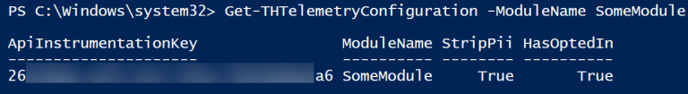
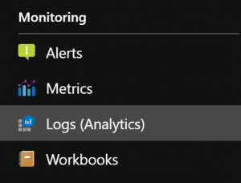
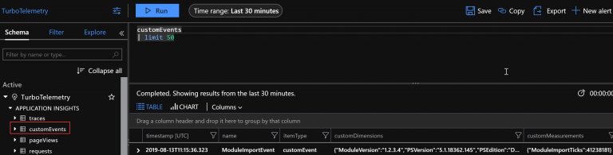
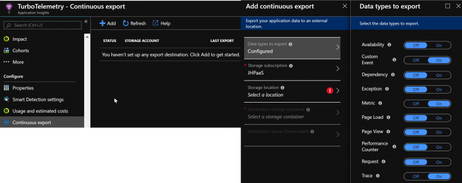

## Add telemetry to your PowerShell module

Ah, telemetry. Very ubiquitous today, telemetry is collected from many software companies, device vendors and so on. Often telemetry includes PII, personally identifiable information, which of course is a no-go.

This post aims to explain how you can responsibly collect telemetry for your PowerShell module to track its usage, version distribution and much more. I will show you the steps you need to take to use Azure ApplicationInsights to collect and Power BI to visualize your telemetry.

Azure ApplicationInsights is usually meant for developers to track the life-cycle of their applications, diagnose issues and aid troubleshooting. But this doesn't mean that it cannot be used in PowerShell and for virtually any purpose you can think of.

### Getting started

To get started, you will need to create an ApplicationInsights resource, a storage account, an Azure SQL database as well as an automation account on Azure.

The way the telemetry collection works is:

1. The client sends metrics, events and traces to ApplicationInsights
1. A continuous export is triggered within ApplicationInsights to persist the data in a storage blob
1. An Azure Automation runbook processes the JSON blob content and sends everything to an Azure SQL database
1. Power BI uses the SQL database as the data source

As you can see there are many moving parts. The parts you can swap are the SQL DBMS and the reporting engine. Whether you are sending to MSSQL, PostGRE or some other engine does not really matter, as long as you can script it. The same goes for reporting – Already have experience with SSRS? Why not. Don't care about reports and just want the raw data? Go ahead.

To collect telemetry with ApplicationInsights I have created a module, TelemetryHelper, which contains the necessary libraries to transmit telemetry in the form of metrics, traces and events.

Metrics are usually aggregated and sent every once in a while, with the standard deviation, median and so forth calculated. Events can carry custom data points as well as metrics. Traces are more or less troubleshooting messages.

### Using the module

The TelemetryHelper module first needs to be configured. To use TelemetryHelper with your module, first of all add it as a dependency in your module's manifest. TelemetryHelper makes use of [PSFramework](https://psframework.org) – an awesome module developed by the brilliant Fred Weinmann. Check out his other stuff while you're at it!

If you are looking for resources on learning PowerShell, checkout the book David and I wrote, Learn PowerShell Core 6.0, or my PowerShell Core 6.2 Cookbook!

You should at the very least configure the ApplicationInsights instrumentation key for your module, for example in an initialization script (or in the config script that's part of your PSFramework module, courtesy of the [PSModuleDevelopment](https://psframework.org/documentation/documents/psmoduledevelopment.html) module!):

```powershell
Set-PSFConfig -Module 'TelemetryHelper' -Name 'YOURMODULENAME.ApplicationInsights.InstrumentationKey' -Value 'YOUR INSTRUMENTATION KEY' -Initialize -Hidden
```

After setting up the instrumentation key, you can already start tracking. To track telemetry, the cmdlets Send-THTrace, THMetric and THEvent can be used. When called for the very first time in a session, an instance of the TelemetryClient .NET class will be stored for you and reused during the session. If you want to see if telemetry can be sent (i.e. User has opted in), you can use the Get-THTelemetryConfiguration cmdlet.



### Tracking an event

Events carry custom data in the form of properties. Properties consist of a dictionary of strings, which can carry most information you might want. With AutomatedLab for example we collect the role names (RootDC, WebServer, …), module version and PS version as an event.

Events can additionally contain metrics, if necessary. You could for example track the PowerShell version, OS type and module version as properties, and attach timings from your module (startup time, date of first import, …) as a metric. Metrics are dictionaries of string-double pairs, so any metric value you track needs to be a double.

Be aware of regulations and laws concerning data collection, for example GDPR. TelemetryHelper by default tries to strip away all PII that is normally sent automatically, like the host name the telemetry is sent from.

However, it will not examine what YOU send. So please be responsible and collect only what you need to improve your module, and ask your users to opt in to the collection rather than just sending telemetry. TelemetryHelper by default will not send telemetry unless the user (or you on their behalf) have agreed to it.

Take a look at the following example:

```powershell
# This is normally part of the module initialization
Set-PSFConfig -Module 'TelemetryHelper' -Name 'SomeModule.OptInVariable' -Value 'SomeModuleOptIn' -Initialize -Hidden
Set-PSFConfig -Module 'TelemetryHelper' -Name 'SomeModule.ApplicationInsights.InstrumentationKey' -Value 'Your Key goes here' -Initialize -Hidden

# build the properties and metrics
$eventProperties = @{
    PSVersion = $PSVersionTable.PSVersion.ToString()
    PSEdition = $PSVersionTable.PSEdition
    ModuleVersion = '1.2.3.4'
}

$eventMetrics = @{
    ModuleImportTicks = 41238181
}

# Sending the first metric will create an instance of a TelemetryClient
# subsequent calls will simply reuse the client
Send-THEvent -EventName ModuleImportEvent -PropertiesHash $eventProperties -MetricsHash $eventMetrics -ModuleName SomeModule -Verbose
Send-THEvent -EventName ModuleImportEvent -MetricsHash $eventMetrics -ModuleName SomeModule -Verbose
Send-THEvent -EventName ModuleImportEvent -PropertiesHash $eventProperties  -ModuleName SomeModule -Verbose
```

In this example, an event with the name ModuleImportEvent is generated, with two hashtables containing properties and metrics. The name of the event will be visible in the exported data and in the metrics stream you can access.




Head on over to Logs and then select customEvents – you should be able to see your data a few seconds after sending it.



### Persisting metrics

As you have seen in the last screenshot, the data is essentially stored as JSON content. To persist your data for a more than 90 days, continuous export is quite useful. Select “Continuous Export” and configure a blob storage container to receive your module's telemetry. You can (and probably should) configure multiple blob containers in the same storage account, so that each of your modules will have a dedicated storage container.



Now every trace sent will automatically be exported to your storage account. Stay tuned for the next post where we will further process the data into a SQL database and build some beautiful reports in Power BI – In the meantime get started with telemetry for your own module!
