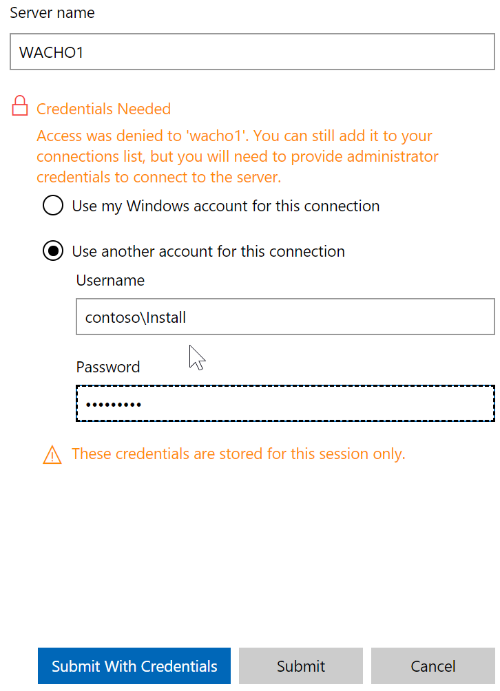
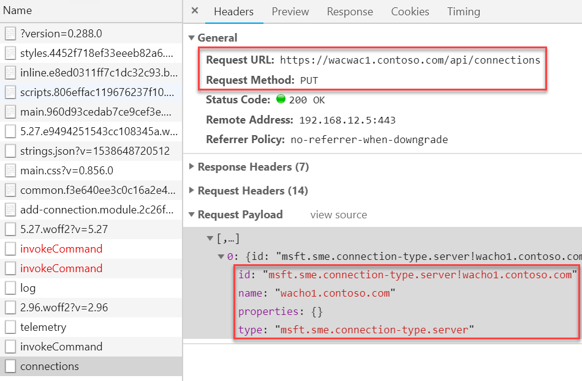

## Automating Windows Admin Center

We all know that [Windows Admin Center](https://learn.microsoft.com/en-us/windows-server/manage/windows-admin-center/overview), formerly known as Project Honolulu, provides excellent and modern management methods for Windows operating systems. Administrators can easily customize their own dashboard and add connections to servers, workstations and storage as well as compute clusters.

However, this is a manual task. As a PowerShell aficionado I cannot abide by that. But let's start at the beginning.

The easiest way to provision a lab with a deployed Windows Admin Center is [AutomatedLab](https://automatedlab.org). AutomatedLab is a lab deployment framework for Windows that works with Azure, Hyper-V and VMWare hypervisors.

```powershell
# Install module
Install-Module AutomatedLab, AutomatedLab.Ships -Force -AllowClobber

# Download sample scripts
New-LabSourcesFolder -Force
```

AutomatedLab can be installed from the PowerShell gallery and allows you to create complex lab environments very easily. For our example, we will be using AutomatedLab to provision an Active Directory domain with a PKI, our intended server to host Windows Admin Center as well as some hosts to play around with.

```powershell
$labName = 'WACLab'
$domainName = 'contoso.com'

New-LabDefinition -Name $labname -DefaultVirtualizationEngine HyperV

Add-LabDomainDefinition -Name $domainName -AdminUser Install -AdminPassword Somepass1
Set-LabInstallationCredential -Username Install -Password Somepass1

$PSDefaultParameterValues = @{
    'Add-LabMachineDefinition:ToolsPath'= "$labSources\Tools"
    'Add-LabMachineDefinition:DomainName' = 'contoso.com'
    'Add-LabMachineDefinition:OperatingSystem' = 'Windows Server 2016 Datacenter'
}

# Domain
$postInstallActivity = @()
$postInstallActivity += Get-LabPostInstallationActivity -ScriptFileName 'New-ADLabAccounts 2.0.ps1' -DependencyFolder $labSources\PostInstallationActivities\PrepareFirstChildDomain
$postInstallActivity += Get-LabPostInstallationActivity -ScriptFileName PrepareRootDomain.ps1 -DependencyFolder $labSources\PostInstallationActivities\PrepareRootDomain
Add-LabMachineDefinition -Name WACDC1 -Memory 1GB -Roles RootDC -PostInstallationActivity $postInstallActivity

# CA
Add-LabMachineDefinition -Name WACCA1 -Memory 1GB -Roles CARoot

Add-LabMachineDefinition -Name WACWAC1 -Memory 1GB

# Some managed hosts
foreach ($i in 1..4)
{
    Add-LabMachineDefinition -Name WACHO$i -Memory 1GB
}

Install-Lab

Show-LabDeploymentSummary
```

The code will deploy a Hyper-V lab using Windows Server 2016 Core and deploy a couple of systems. To demonstrate how WAC can be automated, we need to install it first after the lab deployment has finished.

```powershell
$lab = Get-Lab
$ComputerName = 'WACWAC1'
$WacDownloadLink = 'http://aka.ms/WACDownload'
$labMachine = Get-LabVm -ComputerName $ComputerName
$wacDownload = Get-LabInternetFile -Uri $WacDownloadLink -Path "$(Get-LabSourcesLocationInternal -Local)\SoftwarePackages\WAC.msi" -PassThru -NoDisplay

if ($labMachine.IsDomainJoined -and (Get-LabIssuingCA -DomainName $labMachine.DomainName -ErrorAction SilentlyContinue) )
{
    $cert = Request-LabCertificate -Subject "CN=$($machine.FQDN)" -SAN $labMachine.Name -TemplateName WebServer -ComputerName $labMachine -PassThru -ErrorAction Stop
}

$arguments = @(
    '/qn'
    '/L*v C:\wacLoc.txt'
    "SME_PORT=443"
)
if ($cert.Thumbprint)
{
    $arguments += "SME_THUMBPRINT=$($cert.Thumbprint)"
    $arguments += "SSL_CERTIFICATE_OPTION=installed"
}
else
{
    $arguments += "SSL_CERTIFICATE_OPTION=generate"
}

$installation = Install-LabSoftwarePackage -Path $wacDownload.Path -CommandLine $($arguments -join ' ') -ComputerName $labMachine -ExpectedReturnCodes 0, 3010 -PassThru -NoDisplay
```

Since we are using AutomatedLab, we can leverage its cmdlets in order to request the correct certificate for our WAC machine as well as get the correct parameters ready. `Get-LabInternetFile` will download WAC automatically to your LabSources directory. `Get-LabIssuingCa` is used to check if we installed a certification authority.

With the help of Request-LabCertificate we use the lab's CA to request an SSL certificate for our host and can simply use the thumbprint for the setup of Windows Admin Center. The certificate is automatically enrolled on the machine that is passed to the parameter ComputerName.

After a short while, Windows Admin Center is up and running, and can be accessed:

```powershell
start "https://$($machine.FQDN):$Port"
```

But that was the simple and well-documented part. The not-so-well-documented part (at least I was unable to find out about this) is automatically customizing your deployment of WAC. For this, we will open the developer console on e.g. Chrome with F12 while on the site.

With the developer console opened, just add a server by using the lab credentials that have been used during lab deployment.



While the connection is being initiated you will see several requests in the developer console. Have a look for the entry “connections” – this is the API endpoint we are looking for. Using the developer console you can examine the actual request content.



In the request, we can see the API endpoint used called “api/connections” with the method PUT. The request body is visible as well. This is a very simple JSON structure that translates to an array of hashtables in PowerShell.

```powershell
@{
        id   = 'msft.sme.connection-type.server!SomeHost'
        name = 'SomeHost'
        type = 'msft.sme.connection-type.server'
}
```

This makes it very, very easy to add new connections automatically without ever touching the UI:

```powershell
$bodyHash = foreach ($machine in (Get-LabVm | Where-Object -Property Name -ne $ComputerName))
{
    @{
        id   = "msft.sme.connection-type.server!$($machine.FQDN)"
        name = $machine.FQDN
        type = "msft.sme.connection-type.server"
    }
}

$response = Invoke-RestMethod -Method PUT -Uri $apiEndpoint -Credential $labMachine.GetCredential($lab) -Body $($bodyHash | ConvertTo-Json) -ContentType application/json
```

`Invoke-RestMethod` is your go-to choice to access RESTful APIs. In our case, we can simply authenticate using credentials. By using the PUT method and the URI that we retrieved from the developer console, we can now simply convert the payload to JSON data and pass it to the API.

The response is an array of objects that you can access, but as long as no error occurred during the API call, your machines will be added to your own dashboard (i.e. the user who's credentials you used in the request) and will be visible once you logged out and back in again.

```powershell
# Remove the test lab if necessary
Remove-Lab waclab -confirm:$false
```

I hope you enjoyed this little exercise of reverse-engineering an API!
