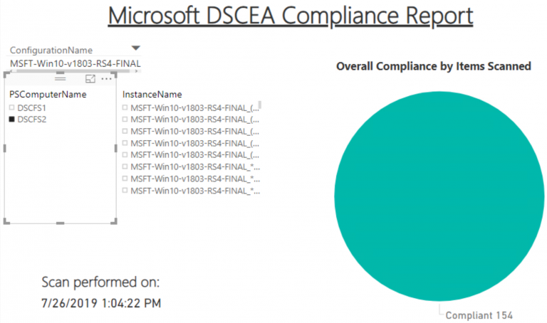

## Testing the infrastructure

*Update 2020-01-14: Lab Script updated due to new cmdlets*

If you have not yet read about Desired State Configuration, now would be the time. Head to [learn.microsoft.com](https://learn.microsoft.com/en-us/powershell/dsc/overview/overview) and understand the concepts before reading further.

The configurations we compiled in the previous blog post require two community resources, AuditPolicyDsc and SecurityPolicyDsc. Registry settings are built-in. Both resources contain the necessary code that your clients need to test the configuration. If you don't trust external code or are not able to get code in your environment, why not create a test environment instead?

The following snippet can take care of that, once you have installed the module AutomatedLab from either the PowerShell Gallery or with the offline installer from <https://github.com/automatedlab/automatedlab/releases>.

```powershell
$labName = 'GPOTODSC'

#create an empty lab template and define where the lab XML files and the VMs will be stored
New-LabDefinition -Name $labName -DefaultVirtualizationEngine HyperV

#and the domain definition with the domain admin account
Add-LabDomainDefinition -Name contoso.com -AdminUser Install -AdminPassword Somepass1

#these credentials are used for connecting to the machines. As this is a lab we use clear-text passwords
Set-LabInstallationCredential -Username Install -Password Somepass1

Add-LabVirtualNetworkDefinition -Name $labName -AddressSpace 192.168.30.0/24

#defining default parameter values, as these ones are the same for all the machines
$PSDefaultParameterValues = @{
    'Add-LabMachineDefinition:Network' = $labName
    'Add-LabMachineDefinition:ToolsPath'= "$labSources\Tools"
    'Add-LabMachineDefinition:DomainName' = 'contoso.com'
    'Add-LabMachineDefinition:DnsServer1' = '192.168.30.10'
    'Add-LabMachineDefinition:DnsServer2' = '192.168.30.11'
    'Add-LabMachineDefinition:OperatingSystem' = 'Windows Server 2016 Datacenter (Desktop Experience)'
}

#The PostInstallationActivity is just creating some users
$postInstallActivity = @()
$postInstallActivity += Get-LabPostInstallationActivity -ScriptFileName 'New-ADLabAccounts 2.0.ps1' -DependencyFolder $labSources\PostInstallationActivities\PrepareFirstChildDomain
$postInstallActivity += Get-LabPostInstallationActivity -ScriptFileName PrepareRootDomain.ps1 -DependencyFolder $labSources\PostInstallationActivities\PrepareRootDomain
Add-LabMachineDefinition -Name DSCDC1 -Memory 2gB -Roles RootDC -IpAddress 192.168.30.10 -PostInstallationActivity $postInstallActivity
Add-LabMachineDefinition -Name DSCFS1 -Memory 2gB
Add-LabMachineDefinition -Name DSCFS2 -Memory 2gB
Add-LabMachineDefinition -Name DSCFS3 -Memory 2gB -OperatingSystem 'Windows Server 2008 R2 Datacenter (Full Installation)'

Install-Lab

Write-ScreenInfo -Message "Downloading additional files and pushing them to root DC"
$tmp = New-Item -ItemType Directory -Path (Join-Path ([IO.Path]::GetTempPath()) -ChildPath DSCEA) -Force

# If this errs, update PackageManagement
Find-MOdule DSCEA,gpotodsc,psframework,AuditPolicyDsc,SecurityPolicyDsc -Repository PSGallery | Save-Module -Path $tmp -Force
$report = Get-Childitem -Filter *.pbix -Path $tmp -Recurse -File

$file = Get-LabInternetFile -Uri https://download.microsoft.com/download/8/5/C/85C25433-A1B0-4FFA-9429-7E023E7DA8D8/PolicyAnalyzer.zip -Path $tmp -PassThru
Copy-LabFileItem -Path $tmp\DSCEA,$tmp\GpoToDsc,$tmp\PSFramework,$tmp\SecurityPolicyDsc,$tmp\AuditPolicyDsc -Destination 'C:\Program Files\WindowsPowerShell\Modules' -ComputerName DSCDC1,DSCFS1,DSCFS2
Copy-LabFileItem -Path $file.FullName -ComputerName DSCDC1
Copy-LabFileItem -Path $report.FullName -ComputerName DSCDC1 -DestinationFolderPath 'C:\users\install\Desktop'

Invoke-LabCommand -ComputerName DSCDC1 -ScriptBlock {
    Expand-Archive C:\PolicyAnalyzer.zip -DestinationPath C:\PolicyAnalyzer -Force
    ConvertTo-G2DValidation -path C:\PolicyAnalyzer\SamplePolicyRules -SkipMerge | Export-G2DValidation -Path C:\Config -Force

    # Configure 1 clean system
    $null = mkdir C:\test, c:\users\ralph\documents\dscea -Force
    Copy-Item C:\Config\MSFT-Win10-v1803-RS4-FINAL\localhost.mof C:\test\DSCFS2.mof
    Start-DscConfiguration -Wait -Path C:\test

    Start-DSCEAscan -MofFile C:\Config\MSFT-Win10-v1803-RS4-FINAL\localhost.mof -ComputerName DSCFS1,DSCFS2 -OutputPath C:\ -ResultsFile dsceascan.xml
    Convert-DSCEAresultsToCSV -InputXML C:\dsceascan.xml -OutFile 'c:\users\ralph\documents\dscea\output.csv'
}

$pbi = Get-LabInternetFile -Uri https://download.microsoft.com/download/9/B/A/9BAEFFEF-1A68-4102-8CDF-5D28BFFE6A61/PBIDesktop_x64.msi -Path $tmp -PassThru
Install-LabSoftwarePackage -Path $pbi.FullName -ComputerName DSCDC1 -CommandLine 'ACCEPT_EULA=1'

Show-LabDeploymentSummary -Detailed
Write-Host -ForegroundColor Magenta 'Connect to DSCDC1 and marvel at the PowerBI dashboard! Connect-LabVm DSCDC1'
```

Before running that code, please keep in mind that you will need to download a Windows Server 2016 ISO to install the operating systems. AutomatedLab supports anything starting with Server 2008 R2 and can also deploy certain Linux distributions. For the best experience, try CentOS 7, which can be installed in the lab domain-joined and ready to go.

The snippet will create an environment consisting of a domain controller and two nodes, in case you want to play a bit with Group Policies. During the deployment, the current security baselines will be downloaded, pushed to the root domain controller DSCDC1 and extracted.

After the extraction, the MOF files will be created from the PolicyRules files that have just been pushed. For reference, the host DSCFS2 will be configured with the settings in one of the security baselines, while the host DSCFS1 will remain as it is. This should get you a good report later on.

My module GpoToDsc in this case creates one MOF for each baseline. Each resource name will contain the policy name, the resource that is set if applicable (e.g. the registry value name) as well as a GUID to introduce some randomness. In the report later on, you can easily distinguish all configured resources which are not in the desired state and filter down to the GPO the setting came from originally.

Once the lab deployment has finished, a report should already have been generated. So just open the PowerBI report you can find on the desktop and refresh the data. You should see something similar to the following:



Whereas DSCFS1 should look slightly different:


There you go. From GPO to DSC configuration in an arbitrary number of probably easy steps!
