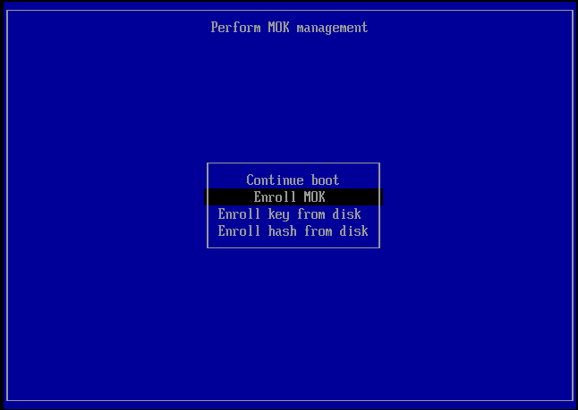

## OBS Virtual Camera on Fedora – Signing kernel modules for Secure Boot

Having been a Linux user since my teenage years, I decided to install Fedora again and use it as my primary desktop OS. Out of the box, everything worked just fine on my Dell Precision 7730 with the WD19TB dock attached. Everything apart from OBS, which was not able to start a virtual camera.

Thus began my journey through loads of horrible advice and the official docs… (Updated 2022-07-16 with a script to sign extra kernel modules)

## A little background

My Linux history started with SuSE 6.1 which came on five CDs. Until we had DSL at home, this was basically it. As soon as the first DSL flat rate came around, I experimented with Debian and Ubuntu, and later with Arch and Gentoo. To this day, Arch still has a special place in my mind as being generally awesome.

Nowadays I don't want to tinker around on the command line as much as back then. I want a solid desktop OS that just works. As I dual-boot Windows on my device for work I already had Bitlocker and Secure Boot enabled, which just worked in Fedora.

After the initial happy phase that I always get on a freshly installed OS, I discovered one tiny thing that I was actually missing: The virtual camera from the Open Broadcaster Software (OBS)! I host a lot of online workshops and take part in the occasional conference, and I don't like people peeking into my office/gaming room. I don't have a separate room dedicated to work like others do, so I hung a green piece of cloth from the ceiling and let OBS and the chromakey filter do the heavy lifting.

On Windows the virtual cam just worked out of the box, which is not really a surprise. On Fedora (and other distributions of course) this would normally work just as well – compile and install the required module, v4l2loopback (video for Linux, v4l) and that's it.

What I did not think of when I tried this was Secure Boot. If you are unfamiliar with Secure Boot: It is part of the UEFI specification and prohibits unsigned software from running. This can for example hinder a rootkit from hooking into the boot process.

In my case, of course the self-compiled module was not signed and there was no way to modprobe it. Moreover, it is not sufficient to "just sign" the module. Part of the security of Secure Boot is the fact that signing keys are not simply on a writable location, but are part of the firmware.

Searching for my particular problem yielded lots of results. The quality of those results however led me to write this post. All of my search results had one piece of advice: "Disable Secure Boot". Awesome. Can't get in your door? Just shoot out the locks. Somehow, I was not very happy after searching.

## How it's done

The only acceptable solution, in my opinion, is to use the system as it was intended to. So my piece of advice is "Just sign the module". Lucky for you, I'm about to walk you through how to do it properly (security of your own certificate notwithstanding…).

With Secure Boot, we as machine owners can provide a machine owner key, or MOK, in addition to the built-in platform keys and key-exchange keys. The MOKs are key pairs consisting of a private and a public key. In a managed environment, these MOKs could come from an internal certificate authority and would be managed by the people responsible for deploying new devices.

In my case, I am my own IT department. My employer lets us choose a device, what we do with it is largely up to us. Thus, I am showing you how to generate a key pair.

> Take extra care that the keys do not get lost and that the private key is secured!
> Both aspects are very important here. After importing the MOK, anyone in possession
> of the private key can sign kernel modules all day long and just have them load.

Don't perceive Secure Boot as a hindrance, but rather as part of your security posture. On that note: Also do not just disable SELinux 😉 Research how to allow things rather than opening the flood gates.

Before we start, have a look at the output of mokutil, the command to interact with the MOK storage.

```bash
mokutil --list-enrolled
```

On a standard system, the output will most likely be empty. After enrolling a new key, the command should return one MOK from Fedora as well as your own key. Writing this post, it has the thumbprint "FD:E3:25:99:C2:D6:1D:B1:BF:58:07:33:5D:7B:20:E4:CD:96:3B:42" and is valid until December 2022.

Following the official Fedora documentation we will start by generating a key pair. To do that, you should install openssl first in case it has not yet been installed.

```bash
dnf list installed openssl
sudo dnf install openssl -y
After that has been done, I went along and created a configuration file for openssl.

cat << EOF > configuration_file.config
[ req ]
default_bits = 4096
distinguished_name = jhpcert
prompt = no
string_mask = utf8only
x509_extensions = extensions

[ jhpcert ]
O = jhp
CN = jhp
emailAddress = jhp@localhost

[ extensions ]
basicConstraints=critical,CA:FALSE
keyUsage=digitalSignature
subjectKeyIdentifier=hash
authorityKeyIdentifier=keyid
EOF
```

Be sure to replace O, CN and the email address with your own information here. Having done that, openssl can be used to create the key pair:

```bash
openssl req -x509 -new -nodes -utf8 -sha256 -days 36500  -batch –config configuration_file.config -outform DER  -out public_key.der  -keyout private_key.priv
```

The last step before you can start signing modules is the import. The public key needs to be imported into the MOK store so that the signatures can be verified. A digital signature is created using the private key and verified using the public key. The public key can of course be freely shared whereas the private key remains – you guessed it – private.

The mokutil command will ask for a password. This password will be used after the next reboot in order to import this new key into the MOK store.

```bash
sudo mokutil --import public_key.der
```

Now you can reboot your machine. During your normal boot process a window will open prompting you to enroll your MOK. It should look similar to what I received.



Simply navigate through the screens until you are prompted for your password.

[MOK enrollment screen showing the selected machine owner key to import](mokenroll2.png)

From here on, you can compile, sign and import any kernel module you desire, without disabling Secure Boot and without tainting the kernel. But please, keep your private key safe and backed up.

## Signing and loading v4l2loopback

I have been using DKMS on Fedora to install and add the kernel module. The step to actually sign the module is the same regardless of that. So if you cloned the git repository for v4l2loopback and ran make and make install, you would still use sign-file to sign the kernel module.

```bash
sudo dnf install -y dkms kernel-devel
version=0.12.5
curl -L https://github.com/umlaeute/v4l2loopback/archive/v${version}.tar.gz | sudo tar xvz -C /usr/src
sudo dkms add -m v4l2loopback -v ${version}
sudo dkms build -m v4l2loopback -v ${version}
sudo dkms install -m v4l2loopback -v ${version}
```
 
On my system, the kernel module was compressed after being compiled. I was used to kernel modules ending in ‘.ko' and what I got here was a ‘.ko.xz' file. So, in order to sign the module we need to extract it first. If you try to sign the zipped file, you will just get an indeterminate error message when trying modprobe.

```bash
sudo unxz /lib/modules/$(uname -r)/extra/v4l2loopback.ko.xz

sudo /usr/src/kernels/$(uname -r)/scripts/sign-file sha256 private_key.priv public_key.der /lib/modules/$(uname -r)/extra/v4l2loopback.ko 

sudo xz -f /lib/modules/$(uname -r)/extra/v4l2loopback.ko
```

Now, all you need to do is load the module using modprobe. I am using the documented options and an arbitrary video card number that is greater than either of my built-in ones.

sudo modprobe -v v4l2loopback devices=1 video_nr=10 card_label="OBS Cam" exclusive_caps=1
Like any other module, you can make this permanent as well by creating the appropriate configuration files.

```bash
echo "v4l2loopback" | sudo tee /etc/modules-load.d/v4l2loopback.conf
echo "options v4l2loopback video_nr=10 card_label=\"OBS Cam\" exclusive_caps=1" | sudo tee /etc/modprobe.d/v4l2loopback.conf
```

I hope this post helped you trying to set up the OBS virtual cam on Linux and any other kernel module that might require signing!

As a little bonus, here's the script that I am currently using to sign my modules again after a kernel upgrade:

```powershell
#!/bin/pwsh
[CmdletBinding()]
param 
(
    [ValidateNotNullOrEmpty()]
    [string]
    $PrivateKeyPath = '/root/mok.priv',

    [ValidateNotNullOrEmpty()]
    [string]
    $PublicKeyPath = '/root/mok.der',
    
    [ValidateSet('sha1', 'sha224', 'sha256', 'sha384', 'sha512')]
    [string]
    $Algorithm = 'sha256'
)

$version = uname -r

if (-not (Test-Path -Path $PrivateKeyPath))
{
    Write-Error -Message "Private key file $PrivateKeyPath missing."
}
if (-not (Test-Path -Path $PublicKeyPath))
{
    Write-Error -Message "Public key file $PublicKeyPath missing."
}

$paths = Get-ChildItem -File -Filter *.ko.xz -Path "/lib/modules/$version/extra" -Recurse
foreach ($path in $paths)
{
    $null = sudo unxz $path.FullName
    Write-Verbose -Message "sudo /usr/src/kernels/$version/scripts/sign-file $Algorithm $PrivateKeyPath $PublicKeyPath $($path.FullName.Replace('.xz', ''))"
    $null = sudo /usr/src/kernels/$version/scripts/sign-file $Algorithm $PrivateKeyPath $PublicKeyPath  $path.FullName.Replace('.xz', '')
    $null = sudo xz -f $path.FullName.Replace('.xz', '')
}
```

## Links and further reading

- Open Broadcaster Software (OBS): <https://obsproject.com/>
- Public-key cryptography: <https://en.wikipedia.org/wiki/Public-key_cryptography>
- v4l2loopback repository and installation: <https://github.com/umlaeute/v4l2loopback#DKMS>
- Table showing different Secure Boot operating modes: <https://docs.fedoraproject.org/en-US/fedora/rawhide/system-administrators-guide/kernel-module-driver-configuration/Working_with_Kernel_Modules/#sect-kernel-module-authentication-requirements>
- Generating the key pair: <https://docs.fedoraproject.org/en-US/fedora/rawhide/system-administrators-guide/kernel-module-driver-configuration/Working_with_Kernel_Modules/#sect-generating-a-public-private-x509-key-pair>
