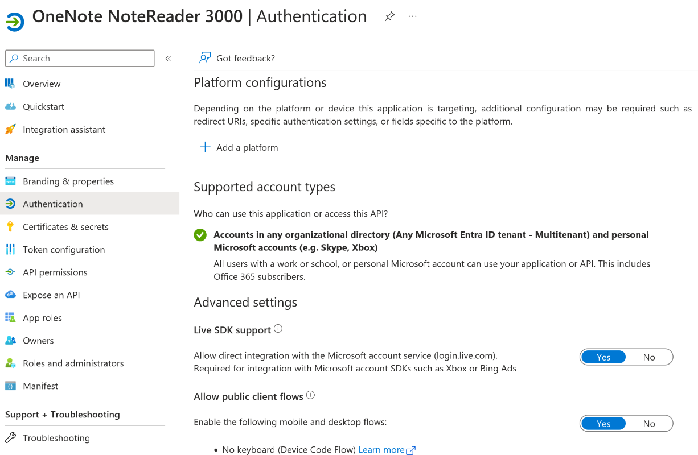

# Free OneNote! ✊

Due to a number of related events I once again got the
notion to replace OneNote with something open and non-proprietary. Since
I was using Obsidian for my personal knowledge management and note taking
for a while now, markdown was going to be that format.

A short internet search netted no serious results apart from some
fiddling around with pandoc, exported notebooks and a lot of manual interaction.
Not very useful. What I would have wanted was something using the Graph API
(<https://learn.microsoft.com/en-us/graph/overview>).

>**Graph what now?**  
>The Graph API is a programming interface for everything
>Microsoft 365 and Entra ID (the artist formerly known as Azure Active Directory)
>with which all administrative tasks can be automated.
>Accessing graph is done through an app registration in Entra ID.

At this very moment it dawned on me that my esteemed colleague
[Friedrich Weinmann](https://github.com/friedrichweinmann/minigraph) with
his MiniGraph module did most of the work that I can't be asked to do:
Authenticating with Entra ID.

## Preparations in Entra ID

To access the Graph API, we need a resource that describes the required
permissions - an app regisration which might later be picked up in an
enterprise app.



To facilitate the export of a personal OneDrive the app needs to
support multi-tenancy. If that isn't the case, all users of your
app need to be invited to your tenant (B2C). Using the app within
the confines of your personal account will not be possible.

Last but not least, we need to configure the necessary Graph permissions as
delegated permissions. To free OneNote, notes.read.all is sufficient.


### Delegated Permissions versus Application Permissions

Delegated permissions describe permissions on resources that the user already
has access to. If for example the rather privileged permission user.read.all is
configured, it does not automatically mean that the user can suddenly read all
Entra accounts.

Likewise, notes.read.all only means that the user can access their own OneNotes
as well as OneNotes shared with them (or rather: accessible to them).

Thinking of the ancient on-premises Active Directory, the equivalent would
be impersonation: One account acts on behalf of another.

Application permissions on the other hand describe permissions of the app registration
itself. If the app is permitted to read all user accounts, all users of your
app will be able to read all accounts. This can have far-reaching and unforseen
consequences.

## Authenticating with MiniGraph - Device Code Flow

Before we can issue some Graph calls, let me tell you a little bit about MiniGraph.

Fred has given us the means to access the Graph API easily and quickly with his
module, supporting all kinds of authentication methods. Which methods you will use depends
on your app registration and the intended usage: Credentials and Certificates are configured
on the App Registration and are used to sign in. Not ideal to free your own OneNote content.

To this end, Connect-GraphBrowser and Connect-GraphDeviceCode exist. Both authentication
flows still require tenant ID and client ID though. Hold on... Isn't the tenant ID
usually unique per tenant and not communicated far and wide? How can you even access
you personal OneNote with a corporate tenant? Well, you can't. This is where the
documentation comes in handy. The tenant ID `Common` can be used in lieu of an
Entra tenant.

You still need to include your app's Client ID or tell it to your users. In C# this
could be an app setting, for PowerShell you can use the brilliant PSFramework. Upon
signing in to the app, a disclaimer will be shown displaying all required app
permissions. The user is required to consent to your app's permissions.

## Free your OneNote in several small steps!

The requirements for our export snippet aren't that complicated:
- Access all or a list of notebooks
- In a single output path, create subfolders per notebook and underneath per section
- Per page, create one markdown file
- Download embedded content to a resources folder and link it

Using this information, we can generate our parameters. A few sensible defaults
like Tenant and Client ID as well as the user, and our cmdlet is nearly done. The user
`me` refers to the signed-in user. Alternatively you can pass a string like `user/GUID OF USER/`
to this parameter.

```powershell
[CmdletBinding(DefaultParameterSetName = 'All')]
param
(
    [Parameter(ParameterSetName = 'Notebook')]
    [Parameter(ParameterSetName = 'All')]
    [string]
    $TenantId = 'Common',

    # Use mine or create your own
    [Parameter(ParameterSetName = 'Notebook')]
    [Parameter(ParameterSetName = 'All')]
    [string]
    $OneNoteAppClientId = '812899b7-584c-4812-8aee-11d3e164d58b',

    [string]
    $User = 'me',

    [Parameter(Mandatory = $true, ParameterSetName = 'Notebook')]
    [string[]]
    $Notebook,

    [Parameter(Mandatory = $true, ParameterSetName = 'All')]
    [switch]
    $All,

    [Parameter(Mandatory = $true, ParameterSetName = 'Notebook')]
    [Parameter(Mandatory = $true, ParameterSetName = 'All')]
    $Path
)

#requires -Module MiniGraph
#requires -Module MarkdownPrince
```

The modules MiniGraph and MarkdownPrince are used here so as to 
not reinvent the wheel. We just need to add a few simple loops and
we're done.

First things first, we need to get all required notebooks. This
is done with the notebooks API. Since it supports the common filter
parameter, we can query a list of notebooks as well. If in doubt, look
at the docs at <https://learn.microsoft.com/en-us/graph/overview>!


```powershell
$notebooks = if ($All.IsPresent)
{
    Invoke-GraphRequest -Query "$($User)/onenote/notebooks"
}
else
{
    $Notebook | ForEach-Object {
        Invoke-GraphRequest -Query "$($User)/onenote/notebooks?`$filter=displayName eq '$($_ -replace "'", "''")'"
    }
}
```

A bit later in my code I noticed that for one particular API call I would
need the bearer token. With this nifty little trick, we can extract it
from the (imported and connected) module:

```powershell
$mg = Get-Module -Name MiniGraph
$token = & $mg { $script:token }
```

Keep this little snippet in mind! You'd be surprised how helpful it can be.

But back to our main topic. The following loops are what I consider
PowerShell basics. Bit by bit we grab all sections for each notebook,
and for each section, we grab all pages. For all pages, we get
the content and embedded objects. To accomplish this feat, we need the
sections and pages APIs.

On the topic of embedded content: This little project only takes care of
embedded images in their own img tags, since my use case did not include
embedded arbitrary content. I rather linked to things instead. I did however
copiously use the OCR from image functionality with pasted images.

To extract the images, we need to deviate quite a bit from the PowerShell foundational
skills. As the content of each page is well-formed HTML, which on top of that
is deserialized to an XmlDocument, we can use an XPath query to find ***all*** img tags,
wherever they may be. No fiddling around with unreadable RegEx or any other
kind of shenanigans. Using the query `//img` we iterate over all XML nodes and
extract all `` elements including their content and attributes. Neat!

After that, each image is downloaded and renamed and the src tag that MarkdownPrince
uses to convert the HTML document to markdown is overwritten with the new destination.
Easy! Downloading the embedded resource is done using Invoke-RestMethod as the response
is binary and it was a lot easier for me to extract the token than to use FileStreams
to write the content. The best tool for the job at hand!

```powershell
foreach ($book in $notebooks)
{
    Write-Verbose -Message "Exporting notebook $($book.displayName)"
    $bookPath = Join-Path -Path $Path -ChildPath $book.displayName
    $sections = Invoke-GraphRequest -Query "$($User)/onenote/notebooks/$($book.id)/sections"
    if (-not (Test-Path -Path $bookPath))
    {
        $null = New-Item -Path $bookPath -ItemType Directory -Force
    }

    foreach ($section in $sections)
    {
        Write-Verbose -Message "Exporting section $($section.displayName)"
        $sectionPath = Join-Path -Path $bookPath -ChildPath $section.displayName
        if (-not (Test-Path -Path $sectionPath))
        {
            $null = New-Item -Path $sectionPath -ItemType Directory -Force
        }
        $pages = Invoke-GraphRequest -Query "$($User)/onenote/sections/$($section.id)/pages"

        foreach ($page in $pages)
        {
            Write-Verbose -Message "Exporting page $($page.title)"
            $sanitizedTitle = $page.title -replace '[\\\/\:\*\?\"\<\>\|]', '_'
            $pagePath = Join-Path -Path $sectionPath -ChildPath "$($page.createdDateTime.ToString('yyyy-MM-dd'))_$($sanitizedTitle).md"
            $content = Invoke-GraphRequest -Query "$($User)/onenote/pages/$($page.id)/content"
            $imgCount = 0
            foreach ($image in $content.SelectNodes("//img"))
            {
                $header = @{
                    Authorization = "Bearer $token"
                }
                $imgName = '{0}_{1:d10}.png' -f $sanitizedTitle, $imgCount
                $imgPath = Join-Path -Path $sectionPath -ChildPath resources
                if (-not (Test-Path -Path $imgPath))
                {
                    $null = New-Item -Path $imgPath -ItemType Directory -Force
                }

                Invoke-RestMethod -Method Get -Uri $image.'data-fullres-src' -Headers $header -OutFile (Join-Path $imgPath $imgName)

                $image.src = [uri]::EscapeUriString(('./resources/{1}' -f $section.displayName, $imgName))
                $imgCount++
            }

            $content.OuterXml | ConvertFrom-HTMLToMarkdown -DestinationPath $pagePath -Format
        }
    }
}
```

The full code can be found on GitHub: <https://github.com/nyanhp/freeing-onenote>

Enjoy freeing OneNote! Do with your markdown content what you like. Host it
using GitHub pages (or not at all), keep it in your file system, you name it. My
personal recommendation is Obsidian, which you can download for free at <https://obsidian.md>.
If you are rather looking for free software (as in GPL or AGPL licensed), Trilium might
be a good alternative.
