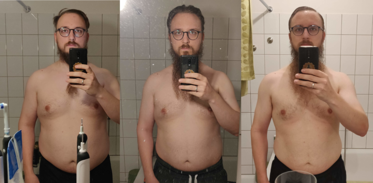

## 90 Day Challenge – Nutrition and before/after

Due to demand, I will add a little follow-up to my first post detailing what I ate before the challenge and how I eat now. I will also show you what amount of training I did before the challenge, and how little I do since. And lastly, semi-nude pictures of my insulated upper body – now with less insulation!

## Nutrition

It should come as no surprise that good nutrition is crucial to live a long and healthy life. For me it boils down to "From where do I get my energy" and "Is there additional value to this food". The first part is – in my opinion – rather important. But please, a disclaimer is in order: I am not a physician!

I get my energy nowadays mainly from Protein and Fat. There is very little room for carbohydrates. I do of course still eat carbs, but I take very good care to eat only the "good carbs". This in essence means (with the words of the great Scooby): Eat Real Food!

Real Food, or unprocessed food, is likely always good. I in particular have the privilege to earn enough money to buy regional and seasonal food, produced on the small farms around my home. Very short ways, very little environmental impact. I do love meat, but eat it a lot less than in the past. It comes down to up to 2 meals per week and I aim to reduce this further to lower my impact.

## Before

Before starting the challenge, my nutrition looked like this:

Breakfast

- At Home: Sourdough bread (German Bread, not that pillowy excuse for food) with cold cuts and cheese. Coffee with milk.
- At Customer (i.e. in hotel): Bread rolls with cold cuts and cheese, orange juice, plain yoghurt with fruits, and of course: A sweet pastry. Coffee with milk.

Lunch

- At home: Often Rice, Noodles, Potatoes which accompanied otherwise healthy dishes like Salmon, Beans and so on
- At customer: Mostly unhealthy shit, there is no reason to sugarcoat it. Currywurst (with Fries), Burger (with Fries), Schnitzel (with Fries… you get the picture)

Snacks
- At home: Whatever I found in the sweets cupboard (which has been emptied during the challenge)
- At customer: Dito

Dinner

- At home: A second warm meal, similar composition as lunch. Sometimes Lunch or Dinner were Salad.
- At customer: An Alibi-Salad with "healthy" sides such as fried chicken. Yoghurt as a "healthy" snack – Dairy products with 30-40% sugar should not be allowed to carry the name Yoghurt!

## After

After starting the challenge, I ate way, way better. A typical day now looks like this (and still does after 270 days):

Breakfast
- At home: Two hard boiled eggs, two pieces of high-fiber Knäckebrot (crispbread?) with cold cuts and cheese. Coffee with milk.
- At hotel: Scrambled eggs with bacon and mushrooms, oatmeal without added sugar. Coffee with milk.

Lunch
- At home: NO rice, wheat products or potatoes. A lot of: fresh vegetables. Sometimes with a piece of salmon or some meat from one of the farms around my home. A lot more colorful and tastier than before
- At customer: This is the hard part – I try to always choose the healthy option, as I can seldomly bring my own food if I am on location for an entire week. So it often comes down to salad with plain chicken. Occasionally a Schnitzel, but in this case without sauce and with salad instead of fries

Snack
- At home: On training days, often a quark or yoghurt with banana and whey protein. On rest days often a handful of nuts, toasted in a pan with sardines and olives – yum!
- At customer: Nothing

Dinner
- At home: See lunch
- At customer: A can of beans and a can of tuna, sometimes with homemade salsa. One of the saddest meals I can think of, but gives me the nutrition I need without tasting overly disgusting. Keeps at room temperature 🙂

On training days, after each training, I would also drink a protein shake with plain Whey protein – no added shit. 100% Whey (I used Impact Whey unflavored from MyProtein). When I couldn't stand the taste of whey with tap water I would sprinkle in half a teaspoon of cinnamon or use (real) apple juice instead of water for a carb influx after training.

In retrospect: Not that hard, and very delicious new ways of preparing vegetables!

## Training

In my last post I mentioned my amount of training before starting the challenge. My training starting 2017 consisted of:

Gym – three times per week
10 Minutes warm up on cross trainer
45-60 minutes weight lifting, full body, same exercises every time
45 minutes on cross trainer
30 minutes running outside (1-2 times per week)
I would argue that with the right nutrition I would have had more success. But if you train so much you start thinking that you are doing enough and that you can eat anything. Well – maybe if you're 20, who knows.

My training now consists of four trainings per week with 24 minutes each session. Add a generous 6 minutes of warm-up/cool-down. That is a whopping 2 hours per week, which is about as much time as I spent on my way to and from the gym before per week. Compare that to 6 hours of training (and the 2 hours travelling to/from the gym)!

I do nothing apart from my 2 hours nowadays. No cardio (that's the best part :D), no stupid weight lifting. Just some intense body-weight exercises. Every training has me sweating and gasping for air, in a good way.

As a little motivation: Even on the worst days, starting the warm-up gave me the last kick I needed to enjoy my training. In the gym on the other hand I half-assed it on such days.

## Before and after

The following pictures were taken two weeks into the challenge, on day 90 and on day 180. The frontal view does not do the success credit, though, as does the soft lighting. But I can now enter and exit all of my pants without undoing them. My very first suit fits again. I had to buy new belts, and once I am at below 15% body weight I will get my business clothes re-tailored.

