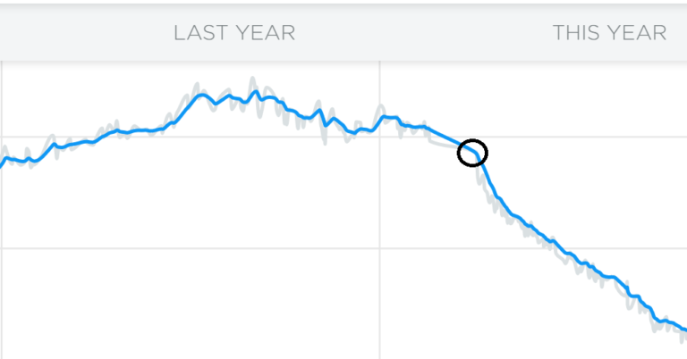

## The 90-Day Challenge – My experience

While the year 2020 at the time of me writing this post is a complete fuck-up as years go, my personal 2020 is pretty excellent. Let me tell you why: It is so very excellent because I lost over 25kg. Much of this was excess fat I carried with me for my entire adult life. If you read this post, it means that I reached 100kg.

In this post, I would like to share the story of my success. Maybe the four and a half readers this site has appreciate it, who knows 🙂 It all started when one of my customers told me about their new awesome training, the 90-Day challenge by Mark Lauren.

At first, I was a bit put off by the idea of participating in a challenge. After all, I've been a regular at my local fitness chain since 2017 with around 6 hours of training per week. But for some reason, I did not lose a single gram throughout those years. My weight oscillated between 120kg and 125kg. There were of course occasional weeks when my weight dipped below 120kg, but these were few and short-lived successes. Since 2006 my lowest weight has been 114kg.

To give you a bit more background: I ate what I perceived healthy, with the occasional sweets here and there. Occasional, in retrospect, was at least two times per week. And not only the serving size printed on the box, but rather MY serving size. At that time, I rationalized my eating habits with the fact that I was working out so much. My main meals were mostly healthy, apart from too much processed wheat flour and too much processed “convenience food”.

> You can always out-eat your exercise

Enter the 90-Day challenge… When I first leafed through the book it seemed simple enough. A couple of exercises, some recipes. Do not get fooled by this though 🙂

## The first weeks

The first two weeks were very intense with regards to the training. While my training time went down rapidly to less than two hours per week, the sheer amount of sweat went up even more rapidly. Fortunately for me, cutting all sugar and most flour from my nutrition was easy. But I definitely felt the withdrawal effects from the sugar – disgusting stuff.

However, the positive impact vastly outweighs the minor inconvenience of looking at the label to see which foods have one of the various forms of sugar in them. And no, honey may be healthy, but it still is sugar. As the saying goes: You can always out-eat your exercise.

The 90-Day challenge is set up so that you work through one page per day, for all of the 90 days. At the beginning, you will have three training days per week, and the rest is off for reflection, helpful tips and exercises like refraining from using your phone for an entire day.

I started seeing the first results on my scale after only two weeks. And from that onward, I lost about 1kg per week during the first 90 days. Easily, I might add, and without feeling like I was missing something.

When the training ramps up to four trainings per week, it does get a bit more intense. But this is not the only progression. Each exercise has three levels. You start out in Level 1, which is supposed to be easy 😉 This is somewhat of a fallacy. All levels are difficult enough and will get you enough training. You do have to exert yourself though – half-assing the training will get you nowhere.

I progressed to Level 2 after two weeks already, and then stayed on Level 2 until day 57. After that I discovered a lot of expletives while training in Level 3 🙂

The book encourages you to really get a good measure of yourself before and after the 90 days. You probably all know this effect: You look at yourself in the mirror every morning, but don't see any change. For me, comparing the pictures I took before and after the challenge was an eye-opening experience. By the way: Not only did I lose weight, I also saved the monthly fee for the gym. The book cost me less than one month at the gym, yet improved my health so much more.

## Continuing the challenge

During the second time I took the challenge, the weight loss slowed down a bit. This I had already expected before starting, so it did not really surprise me. I still got great results, week after week. When I ended challenge 2, I was at 105kg weight. This is when I started measuring my body fat content.

My new goal is not weight-based, but rather based on the amount of body fat. I am trying to reach 10-15% body fat, which would make me extremely happy. My nutrition has not really changed during the three iterations of the challenge. I still do not eat sugar and I am very wary of processed flour. What I do eat is lots of vegetables, every now and then meat from the farms around my home and eggs. Lots. Of. Eggs.

For me, the most important change was to eat way more protein than before, and favor high-fiber foods as well as good fat. This is the thing that I had a hard time understanding before the challenge: Up until this day, I am consuming a lot more than before starting the challenge. Before the challenge, I would eat around 2000kcal per day, which is actually not enough for a man of my size. And of course I did not get enough protein, but too much sugar and low-value carbs.

While I am not a fan of counting calories, it did help in the beginning just to get a measure of how much real food was required to properly feed me. I would often eat a hand full of toasted nuts with olives and sardines as a snack in the evening and still only barely make the calories required for my basal metabolic rate (the minimum amount of energy to keep your body functioning at rest), let alone the calories actually required to keep me at peak performance. Your car will run with too little oil, but sooner or later it will break down.

I got better with nutrition after the first couple of weeks, but it takes some getting used to. Who knew that vegetables would be so filling 😀 Also, mid-morning and afternoon snacks have become “a thing”, at least on training days. Yoghurt or quark, with some banana and whey protein mixed in. A hand full of nuts. These types of snack.

All in all, I would like to leave you with a recommendation: Give the challenge a try, and encourage others to try if you are enjoying it! There are plenty of excuses not to start, so get them all out of your system and just start next Monday!

The next post gives you some more insights into my nutrition and training before and after starting the challenge.

## Recommended Reading

Apart from the 90 day challenge I would also recommend Mark's other book, You Are Your Own Gym. The 90 day challenge is essentially a training program that contains some nutrition tips. If after 90 days you want to continue (and you will want to continue 🙂 ), this book might be good. It contains more background knowledge regarding nutrition and exercise, as well as a huge list of exercises and some sample training plans.

There are also plenty of free resources on the internet, of course. Among the sheer amount of noise and unhealthy or even dangerous tips there are some rare great sources. The one person that I constantly refer back to when looking for exercise and nutrition tips is Scooby (formerly https://scoobysworkshop.com) and his YouTube channel https://www.youtube.com/channel/UC1XHNZDn3btv7454Pkz7THg. He has been at it for years, and the articles and videos he publishes are not only for body builders.
